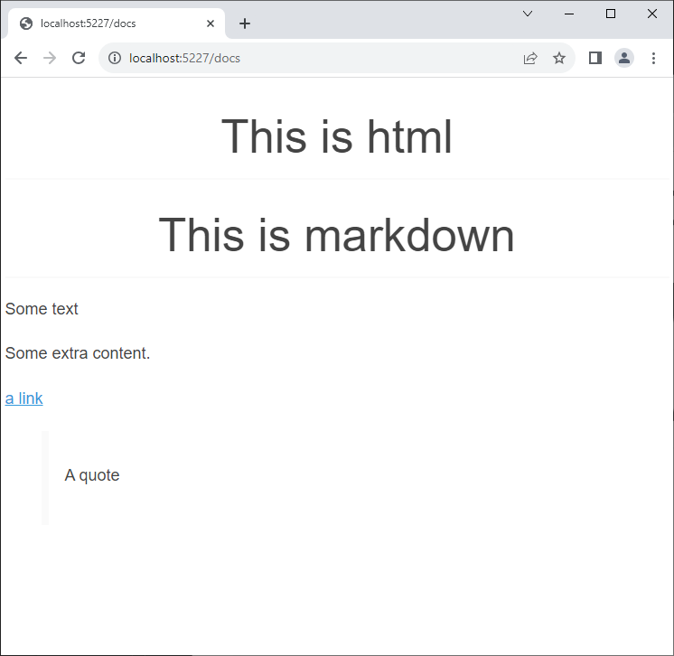
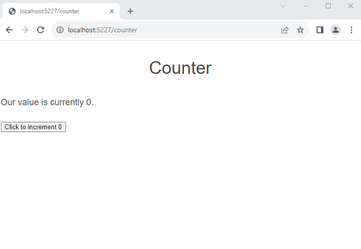
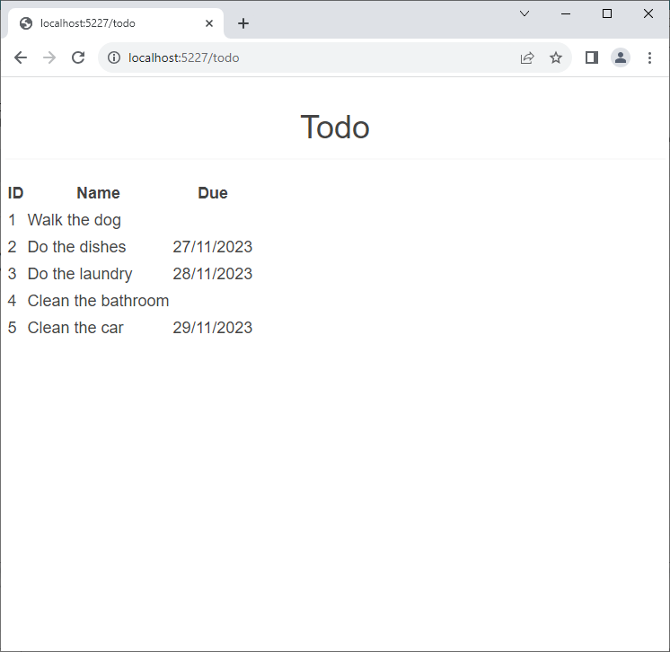

# MarkdownBlazor

> Very early beta stage; use with care/fear as appropriate. 💀

Render interactive inline-markdown in a Blazor app to create interactive docs that are easy to write. 
Can run in Server or WebAssembly mode, and works with pre-rendering.

Lets you do this:

```razor
@page "/docs"

<h2>This is html</h2>

<Markdown>

    ## This is markdown

    Some text

    Some extra content.

    [a link](https://google.com)

    > A quote
        
</Markdown>
```



Interactivity works (i.e. the output will update, in response to external changes).  

> I make *some* effort to emit sensible diffs to blazor so only the actual changed 
> markdown elements propagate, but there is a limit to how good that can be.

> [!IMPORTANT] 
> I'm *not* expecting people to start rendering big apps using markdown; however if you want a bit of interactivity in your docs,
> this may be a nice way to do it. The server-side rendering in .NET 8 makes this actually viable.


So you can also do this:

```razor
@page "/counter"

<Markdown>

    # Our Value

    Our value is currently @_counter.

</Markdown>

<button @onclick="CounterClicked">Click to increment @_counter</button>

@code {
    int _counter = 0;

    void CounterClicked()
    {
        _counter++;
    }
}
```



Loops, conditionals and other code constructs inside the Markdown work as you might expect. 
Because the razor parser doesn't expect literal text directly inside a for loop, you can use an empty element `<></>` to
delineate, and I strip it from the output.

You can do markdown tables pretty nicely this way:

```razor
@page "/todo"
<h3>Todo</h3>

<Markdown>    
    | ID | Name | Due |
    | -- | ---- | --- |
    @foreach(var item in _sampleTodos)
    {
        <>
        | @item.Id | @item.Title | @item.DueBy |
        </>
    }
</Markdown>

@code {

    public record TodoEntry(int Id, string? Title, DateOnly? DueBy = null, bool IsComplete = false);

    private TodoEntry[] _sampleTodos = new TodoEntry[] {
        new(1, "Walk the dog"),
        new(2, "Do the dishes", DateOnly.FromDateTime(DateTime.Now)),
        new(3, "Do the laundry", DateOnly.FromDateTime(DateTime.Now.AddDays(1))),
        new(4, "Clean the bathroom"),
        new(5, "Clean the car", DateOnly.FromDateTime(DateTime.Now.AddDays(2)))
    };
}
```

